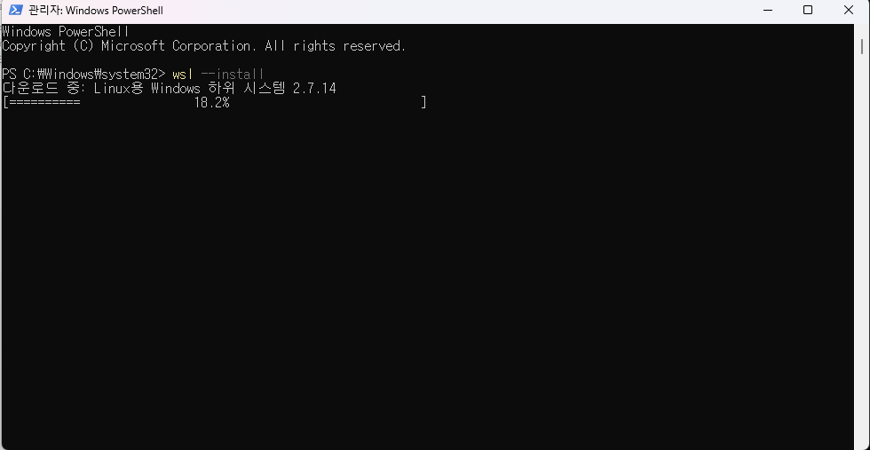
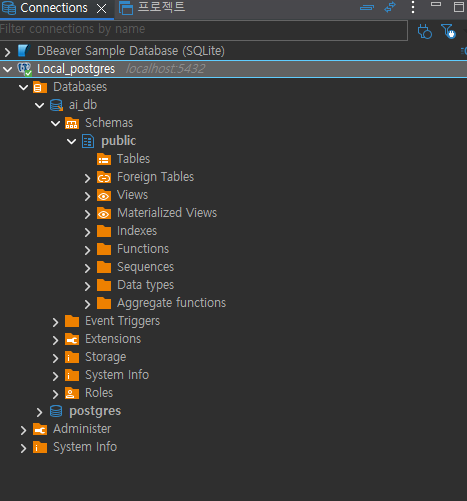

# ai_DB_2026

ai에이전틱_DB리포지토리

## 1일차

### PostgreSQL 소개

데이터베이스. 데이터를 한군데에서 관리하는 목적의 시스템

Postgres라고도 부르는 **관계형** 데이터베이스.

`SQL`을 통해서 데이터를 저장, 수정, 삭제, 조회 할 수 있는 시스템

- 관계형 데이터베이스
  - Oracle
  - MySQL
  - SQL Server

PostgreSQL은 **오픈소스 시스템**으로, 라이선스 비용 없이 사용할 수 있음.

#### DB의 특징

- 데이터 무결성
- 데이터 안정성
- 데이터 동시성
- 표준SQL 지원
- 확장성

### PostgreSQL 설치

직접 설치와 Docker 설치 중 한 가지 방법을 선택한다. 설치를 마치면 공통으로 DBeaver에서 접속한다.

#### 직접 설치

1. Windows용 PostgreSQL 설치 파일 실행
   - 수업에서 사용한 파일: `postgresql-18.6-3-windows-x64.exe`
2. 관리자 계정 `postgres`의 비밀번호 설정
3. 포트 설정: 기본값 `5432`
4. 설치 완료 후 PostgreSQL 서비스가 실행 중인지 확인

<table>
  <tr>
    <td>
      
    </td>
    <td>
      <b>비밀번호 설정</b><br><br>
      • superuser 아이디: <code>postgres</code><br>
      • 비밀번호: ex) <code>123456</code>
    </td>
  </tr>
</table>

<table>
  <tr>
    <td>
      
    </td>
    <td>
      <b>포트 설정</b><br><br>
      • Port: <code>5432</code><br>
      • 기본 PostgreSQL 포트는 5432
    </td>
  </tr>
</table>

#### Docker로 설치

##### Docker 개념

- Docker: 프로그램을 컨테이너로 실행하여 환경 차이를 줄이는 도구
- 이미지: 실행에 필요한 프로그램, 라이브러리, 설정 등을 담은 패키지
- 컨테이너: 이미지를 바탕으로 생성한 실행 환경
- Docker Desktop: Windows에서 Docker를 편리하게 사용할 수 있도록 제공하는 프로그램

##### Docker Desktop 및 WSL 설치

Windows에서 WSL 2를 사용하는 순서로 정리한다.

1. 관리자 권한으로 PowerShell 실행
2. WSL(Windows Subsystem for Linux)이 없다면 `wsl --install` 실행 후 재부팅
   - 이미 설치되어 있다면 `wsl --update`로 업데이트
3. [Docker Desktop Windows 설치 안내](https://docs.docker.com/desktop/setup/install/windows-install/)에서 설치 파일을 내려받아 실행
4. 설치 중 WSL 2 사용 옵션이 표시되면 선택하고, 재부팅 안내가 나오면 재부팅
5. Docker Desktop을 실행하고 엔진이 준비될 때까지 대기
   - 설정에 `Use WSL 2 based engine` 항목이 표시되면 활성화 여부 확인

참고: [Docker의 WSL 2 설정 안내](https://docs.docker.com/desktop/features/wsl/)

<table>
  <tr>
    <td>
      
    </td>
    <td>
      <b>PowerShell을 관리자권한으로 실행</b><br><br>
      <b>wsl --install를 입력</b><br><br>
    </td>
  </tr>
</table>

##### PostgreSQL 이미지 다운로드 및 컨테이너 실행

Docker Desktop이 실행 중인 상태에서 PowerShell에 아래 명령어를 차례로 입력한다.

1. PostgreSQL 이미지 다운로드

```bash
docker pull postgres:latest
```

2. 다운로드한 이미지로 컨테이너 생성 및 실행

```bash
docker run --name my-postgres -e POSTGRES_PASSWORD=123456 -p 25432:5432 -d postgres:latest
```

- `--name my-postgres`: 컨테이너 이름
- `POSTGRES_PASSWORD=123456`: 실습용 관리자 비밀번호
- `-p 25432:5432`: 내 PC의 25432 포트를 컨테이너의 PostgreSQL 포트 5432에 연결
- `-d`: 백그라운드 실행

3. 실행 상태 확인

```bash
docker ps
docker logs my-postgres
```

`my-postgres`가 실행 중이고 로그에 `database system is ready to accept connections`가 표시되면 접속할 수 있다.

### DBeaver 설치 및 DB 접속

DBeaver는 GUI로 데이터베이스를 관리하고 SQL을 실행하는 도구다.

#### DBeaver 설치

1. [DBeaver 다운로드](https://dbeaver.io/download/)에서 Windows용 설치 파일 다운로드
2. 설치 후 DBeaver 실행

#### DB 접속

1. 새 데이터베이스 연결에서 PostgreSQL 선택
2. 선택한 설치 방법에 맞게 아래 설정 입력

| 설정 | 직접 설치 | Docker 설치(위 명령어 기준) |
| --- | --- | --- |
| Host | `localhost` | `localhost` |
| Port | `5432` | `25432` |
| Database | `postgres` | `postgres` |
| Username | `postgres` | `postgres` |
| Password | 설치할 때 설정한 비밀번호 | `123456` |

3. `Test Connection` 클릭 후 드라이버 다운로드 안내가 나오면 다운로드
4. 정상 접속 확인 후 완료 클릭

아직 `ai_db`를 생성하지 않았으므로, 처음에는 기본 데이터베이스인 `postgres`에 접속한다.

참고: [DBeaver의 PostgreSQL 연결 설정](https://dbeaver.com/docs/dbeaver/Database-driver-PostgreSQL/)

### PostgreSQL 기본 구조

<table>
  <tr>
    <td>
      
    </td>
    <td>
      <b>ai_db : 데이터베이스(프로젝트 전체 공간)</b><br><br>
      <b>Schemas : DB 안에서 테이블 등을 묶는 공간(예: public)</b><br><br>
      <b>Tables : 실제 데이터를 담는 표</b><br><br>
    </td>
  </tr>
</table>

### SQL 기본

데이터베이스에서 데이터를 다루는 기본 동작은 CRUD다.

- SQL: Structured Query Language (구조화된 질의 언어)
- SQL로 작성한 명령문을 보통 쿼리라고 부른다.

#### CRUD 정의

데이터 **처리의 기본 동작** 네 가지

| 구분 | 의미 | SQL 명령어 |
| --- | --- | --- |
| Create | 데이터 생성(삽입) | `INSERT` |
| Read | 데이터 조회 | `SELECT` |
| Update | 데이터 수정 | `UPDATE` |
| Delete | 데이터 삭제 | `DELETE` |

### DB 생성

1. `postgres` 연결에서 SQL 편집기 열기
2. 새 이름으로 저장 클릭 후 `*.sql`로 저장
3. 아래 구문 실행

```sql
 -- 새 데이터베이스 생성 
 create database ai_db;
```

- 입력 후 실행(Ctrl + Enter) 후 새로고침(F5)

### PostgreSQL 기본 타입

| 데이터 타입 |        설명        |          예제          |
| :---------: | :----------------: | :---------------------: |
|     INT     |        정수        |       10, 25, -9       |
|   BIGINT   |      큰 정수      |    1000000000000...    |
|   NUMERIC   |    정확한 소수    |        120000.56        |
| VARCHAR(n) |  길이 제한 문자열  |        '홍길동'        |
|    TEXT    | 긴 문자열(대략 1G) |    뉴스 게시물 본문    |
|   BOOLEAN   |      참 거짓      |       true, false       |
|    DATE    |        날짜        |       2026-09-15       |
|  TIMESTAMP  | 일자(날짜 + 시간) | 2026-09-15 16:00:30.125 |
|    JSONB    |    JSON 데이터    |   {"name" : "홍길동"}   |

### 테이블 생성

1. DBeaver에서 새 PostgreSQL 연결을 만들고 Database를 `ai_db`로 설정
   - Host, Port, Username, Password는 앞서 사용한 연결과 동일
2. 연결을 테스트하고 완료한 뒤, `ai_db` 연결에서 SQL 편집기 열기
3. 현재 데이터베이스가 `ai_db`, 스키마가 `public`인지 확인한 뒤 아래 구문 실행

`ai_db`는 데이터베이스 이름이고, `public`은 그 안의 기본 스키마다.

```sql
 -- Table 생성
create table students (
   id int generated always as identity primary key,	    -- 학생 구분값 자동증가
   name varchar(50) not null,							-- 이름
   age int,											    -- 나이
   email varchar(100),									-- 이메일
   created_at timestamp default current_timestamp 		-- 현재 작성된 일자
);
```

- 입력 후 실행(Ctrl + Enter) 후 새로고침(F5)

### 데이터 조작어(DML)


#### INSERT

```sql
 -- Insert문 예제
insert into students (name, age, email) values 
('홍길동', 20, 'hong@example.com'),
('김철수', 21, 'KIM1@example.com'),
('김영희', 21, 'KIM2@example.com');
```

#### SELECT

```sql
-- Select문 예제
select * from students;
select name from students;
```

#### UPDATE

```sql
-- Update문 예제
update students set
	email = 'hong@kakao.com'
	where id = 1;
```

#### DELETE

```sql
-- Delete문 예제
delete from students 
  where name = '홍길동';
```

## 2일차
