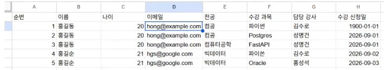

# ai_DB_2026

ai에이전틱_DB리포지토리

## 1일차

### PostgreSQL 소개

데이터베이스. 데이터를 한군데에서 관리하는 목적의 시스템

Postgres라고도 부르는 **관계형** 데이터베이스.

`SQL`을 통해서 데이터를 저장, 수정, 삭제, 조회 할 수 있는 시스템

- 관계형 데이터베이스
  - Oracle
  - MySQL
  - SQL Server

PostgreSQL은 **오픈소스 시스템**으로, 라이선스 비용 없이 사용할 수 있음.

#### DB의 특징

- 데이터 무결성: 정해진 규칙에 맞는 데이터를 유지
- 데이터 안정성: 장애로부터 데이터를 보호하고 복구할 수 있도록 관리
- 데이터 동시성: 여러 사용자가 동시에 데이터를 조회·변경할 수 있도록 관리
- 표준 SQL 지원: 표준 SQL 문법으로 데이터를 다룰 수 있음
- 확장성: 필요에 따라 기능이나 처리 능력을 확장할 수 있음

### PostgreSQL 설치

직접 설치와 Docker 설치 중 한 가지 방법을 선택한다. 설치를 마치면 공통으로 DBeaver에서 접속한다.

#### 직접 설치

1. Windows용 PostgreSQL 설치 파일 실행
   - 수업에서 사용한 파일: `postgresql-18.6-3-windows-x64.exe`
2. 관리자 계정 `postgres`의 비밀번호 설정
3. 포트 설정: 기본값 `5432`
4. 설치 완료 후 PostgreSQL 서비스가 실행 중인지 확인

<table>
  <tr>
    <td>
      
    </td>
    <td>
      <b>비밀번호 설정</b><br><br>
      • superuser 아이디: <code>postgres</code><br>
      • 비밀번호: ex) <code>123456</code>
    </td>
  </tr>
</table>

<table>
  <tr>
    <td>
      
    </td>
    <td>
      <b>포트 설정</b><br><br>
      • Port: <code>5432</code><br>
      • 기본 PostgreSQL 포트는 5432
    </td>
  </tr>
</table>

#### Docker로 설치

##### Docker 개념

- Docker: 프로그램을 컨테이너로 실행하여 환경 차이를 줄이는 도구
- 이미지: 실행에 필요한 프로그램, 라이브러리, 설정 등을 담은 패키지
- 컨테이너: 이미지를 바탕으로 생성한 실행 환경
- Docker Desktop: Windows에서 Docker를 편리하게 사용할 수 있도록 제공하는 프로그램

##### Docker Desktop 및 WSL 설치

Windows에서 WSL 2를 사용하는 순서로 정리한다.

1. 관리자 권한으로 PowerShell 실행
2. WSL(Windows Subsystem for Linux)이 없다면 `wsl --install` 실행 후 재부팅
   - 이미 설치되어 있다면 `wsl --update`로 업데이트
3. [Docker Desktop Windows 설치 안내](https://docs.docker.com/desktop/setup/install/windows-install/)에서 설치 파일을 내려받아 실행
4. 설치 중 WSL 2 사용 옵션이 표시되면 선택하고, 재부팅 안내가 나오면 재부팅
5. Docker Desktop을 실행하고 엔진이 준비될 때까지 대기
   - 설정에 `Use WSL 2 based engine` 항목이 표시되면 활성화 여부 확인

참고: [Docker의 WSL 2 설정 안내](https://docs.docker.com/desktop/features/wsl/)

<table>
  <tr>
    <td>
      
    </td>
    <td>
      <b>PowerShell을 관리자권한으로 실행</b><br><br>
      <b>wsl --install를 입력</b><br><br>
    </td>
  </tr>
</table>

##### PostgreSQL 이미지 다운로드 및 컨테이너 실행

Docker Desktop이 실행 중인 상태에서 PowerShell에 아래 명령어를 차례로 입력한다.

1. PostgreSQL 이미지 다운로드

```bash
docker pull postgres:latest
```

2. 다운로드한 이미지로 컨테이너 생성 및 실행

```bash
docker run --name my-postgres -e POSTGRES_PASSWORD=123456 -p 25432:5432 -d postgres:latest
```

- `--name my-postgres`: 컨테이너 이름
- `POSTGRES_PASSWORD=123456`: 실습용 관리자 비밀번호
- `-p 25432:5432`: 내 PC의 25432 포트를 컨테이너의 PostgreSQL 포트 5432에 연결
- `-d`: 백그라운드 실행

3. 실행 상태 확인

```bash
docker ps
docker logs my-postgres
```

`my-postgres`가 실행 중이고 로그에 `database system is ready to accept connections`가 표시되면 접속할 수 있다.

### DBeaver 설치 및 DB 접속

DBeaver는 GUI로 데이터베이스를 관리하고 SQL을 실행하는 도구다.

#### DBeaver 설치

1. [DBeaver 다운로드](https://dbeaver.io/download/)에서 Windows용 설치 파일 다운로드
2. 설치 후 DBeaver 실행

#### DB 접속

1. 새 데이터베이스 연결에서 PostgreSQL 선택
2. 선택한 설치 방법에 맞게 아래 설정 입력

| 설정 | 직접 설치 | Docker 설치(위 명령어 기준) |
| --- | --- | --- |
| Host | `localhost` | `localhost` |
| Port | `5432` | `25432` |
| Database | `postgres` | `postgres` |
| Username | `postgres` | `postgres` |
| Password | 설치할 때 설정한 비밀번호 | `123456` |

3. `Test Connection` 클릭 후 드라이버 다운로드 안내가 나오면 다운로드
4. 정상 접속 확인 후 완료 클릭

아직 `ai_db`를 생성하지 않았으므로, 처음에는 기본 데이터베이스인 `postgres`에 접속한다.

참고: [DBeaver의 PostgreSQL 연결 설정](https://dbeaver.com/docs/dbeaver/Database-driver-PostgreSQL/)

### PostgreSQL 기본 구조

<table>
  <tr>
    <td>
      
    </td>
    <td>
      <b>ai_db : 데이터베이스(프로젝트 전체 공간)</b><br><br>
      <b>Schemas : DB 안에서 테이블 등을 묶는 공간(예: public)</b><br><br>
      <b>Tables : 실제 데이터를 담는 표</b><br><br>
    </td>
  </tr>
</table>

### SQL 기본

데이터베이스에서 데이터를 다루는 기본 동작은 CRUD다.

- SQL: Structured Query Language (구조화된 질의 언어)
- SQL로 작성한 명령문을 보통 쿼리라고 부른다.

#### CRUD 정의

데이터 **처리의 기본 동작** 네 가지

| 구분 | 의미 | SQL 명령어 |
| --- | --- | --- |
| Create | 데이터 생성(삽입) | `INSERT` |
| Read | 데이터 조회 | `SELECT` |
| Update | 데이터 수정 | `UPDATE` |
| Delete | 데이터 삭제 | `DELETE` |

### DB 생성

1. `postgres` 연결에서 SQL 편집기 열기
2. 새 이름으로 저장 클릭 후 `*.sql`로 저장
3. 아래 구문 실행

```sql
 -- 새 데이터베이스 생성 
 create database ai_db;
```

- 입력 후 실행(Ctrl + Enter) 후 새로고침(F5)

### PostgreSQL 기본 타입

데이터 타입은 각 열에 저장할 값의 종류를 정한다. 예를 들어 이름은 문자열, 나이는 정수 타입으로 지정한다.

| 데이터 타입 |        설명        |          예제          |
| :---------: | :----------------: | :---------------------: |
|     INT     |        정수        |       10, 25, -9       |
|   BIGINT   |      큰 정수      |    1000000000000...    |
|   NUMERIC   |    정확한 소수    |        120000.56        |
| VARCHAR(n) |  길이 제한 문자열  |        '홍길동'        |
|    TEXT    | 긴 문자열(대략 1G) |    뉴스 게시물 본문    |
|   BOOLEAN   |      참 거짓      |       true, false       |
|    DATE    |        날짜        |       2026-09-15       |
|  TIMESTAMP  | 일자(날짜 + 시간) | 2026-09-15 16:00:30.125 |
|    JSONB    |    JSON 데이터    |   {"name" : "홍길동"}   |

### 테이블 생성

테이블은 데이터를 행과 열로 저장하는 구조다.


1. DBeaver에서 새 PostgreSQL 연결을 만들고 Database를 `ai_db`로 설정
   - Host, Port, Username, Password는 앞서 사용한 연결과 동일
2. 연결을 테스트하고 완료한 뒤, `ai_db` 연결에서 SQL 편집기 열기
3. 현재 데이터베이스가 `ai_db`, 스키마가 `public`인지 확인한 뒤 아래 구문 실행

`ai_db`는 데이터베이스 이름이고, `public`은 그 안의 기본 스키마다.

```sql
 -- Table 생성
create table students (
   id int generated always as identity primary key,	    -- 학생 구분값 자동증가
   name varchar(50) not null,							-- 이름
   age int,											    -- 나이
   email varchar(100),									-- 이메일
   created_at timestamp default current_timestamp 		-- 현재 작성된 일자
);
```

- `PRIMARY KEY`: 각 행을 고유하게 구분하는 기본 키.   중복, NULL의 허용X
- `GENERATED ALWAYS AS IDENTITY`: 식별 번호를 자동 생성
- `NOT NULL`: 값이 비어 있는 상태(NULL)를 허용하지 않음
- `DEFAULT`: 값을 생략했을 때 사용할 기본값 지정

- 입력 후 실행(Ctrl + Enter) 후 새로고침(F5)

### 데이터 조작어(DML)

- DML(Data Manipulation Language)은 테이블의 데이터를 추가·수정·삭제하는 SQL 명령어다.
- 여기서는 데이터 조회(SELECT)도 함께 다루며, CRUD의 네 가지 기본 동작을 실습한다.
- [예제 보러가기](./DB_Practice/practice01.sql)

#### 데이터 생성 (INSERT문)
- Insert 쿼리를 통해 데이터를 추가
- 추가 후 select 쿼리로 확인

```sql
 -- Insert문 예제
insert into students (name, age, email) values 
('홍길동', 20, 'hong@example.com'),
('김철수', 21, 'KIM1@example.com'),
('김영희', 21, 'KIM2@example.com');
```

#### 데이터 조회 (SELECT문)

- `SELECT`는 테이블의 데이터를 조회한다. 
- `*`를 사용하면 모든 열을 조회하고, 원하는 열 이름을 지정하면 해당 열만 조회한다.
- 여러 열을 조회하려면 `name`, `age`처럼 열 이름을 쉼표로 구분한다.

```sql
-- Select문 예제
select * from students;
select name, age from students;
```

#### 데이터 수정 (UPDATE문)

- `UPDATE`는 테이블의 데이터를 수정하고, `SET`으로 변경할 열과 값을 지정한다.

```sql
-- Update문 예제
update students set
	email = 'hong@kakao.com'
	where id = 1;
```

#### 데이터 삭제 (DELETE문)

- `DELETE`는 테이블에서 행을 삭제한다.

```sql
-- Delete문 예제
delete from students 
  where name = '홍길동';
```

## 2일차

### 데이터 조회 활용
- [예제 보러가기](./DB_Practice/practice02.sql)

#### 조건 지정 (WHERE절)

- `WHERE`는 조건에 맞는 행만 조회·수정·삭제하도록 대상을 지정한다.
- EX) `WHERE id = 1`은 `id`가 1인 행을, `WHERE name = '홍길동'`은 이름이 홍길동인 행을 대상으로 한다.
- `UPDATE`나 `DELETE`에서 `WHERE`를 생략하면 테이블의 모든 행이 수정·삭제 대상이 되니 주의.
- 여러 조건을 연결할 때는 `AND` 또는 `OR`를 사용한다.
  - `AND`: 모든 조건을 만족하는 행
  - `OR`: 조건 중 하나 이상을 만족하는 행
- `AND`와 `OR`를 함께 사용할 때는 괄호로 조건을 묶으면 의도를 명확하게 표현할 수 있다.

```sql
-- 나이가 21이면서 이름이 '김'으로 시작하는 학생
select * from students
where age = 21 and name like '김%';

-- 나이가 20이거나 21인 학생
select * from students
where age = 20 or age = 21;

-- 나이가 20 또는 21이면서 이름이 '김'으로 시작하는 학생
select * from students
where (age = 20 or age = 21) and name like '김%';
```

#### 문자열 패턴 검색 (LIKE 연산자)

- `LIKE`는 문자열이 특정 패턴과 일치하는지 비교하는 연산자로, `WHERE`절에서 원하는 데이터를 찾을 때 사용한다.
- `%`: 글자가 없거나 여러 글자인 경우에 일치
- `_`: 정확히 한 글자에 일치

```sql
-- 이름이 '김'으로 시작하는 학생 조회
select * from students where name like '김%';

-- 이름에 '영'이 포함된 학생 조회
select * from students where name like '%영%';

-- 이름이 '수'로 끝나는 학생 조회
select * from students where name like '%수';

-- '김' 뒤에 정확히 두 글자가 오는 학생 (김OO) 조회
select * from students where name like '김__';
```

#### 조회 결과 정렬 (ORDER BY절)

- `ORDER BY`는 조회 결과를 지정한 열의 값에 따라 정렬한다. 저장된 데이터 자체의 순서를 바꾸는 것은 아니다.
- `ASC`: 오름차순(작은 값부터), 생략하면 기본 적용
- `DESC`: 내림차순(큰 값부터)
- 여러 열을 쉼표로 구분하면 앞의 열부터 정렬하고, 값이 같을 때 다음 열을 기준으로 정렬한다.
- `WHERE`와 함께 사용하면 `ORDER BY`를 `WHERE` 뒤에 작성한다.
- `ORDER BY`를 지정하지 않으면 조회 결과의 순서는 보장되지 않는다.

```sql
-- 나이가 적은 순으로 조회하고, 나이가 같으면 id가 작은 순으로 정렬
select * from students
order by age asc, id asc;

-- 이름이 '김'으로 시작하는 학생을 나이가 많은 순으로 조회
select * from students
where name like '김%'
order by age desc, id asc;
```
#### 조회 결과 개수 제한 (LIMIT절)

- `LIMIT`은 조회 결과로 반환할 행의 최대 개수를 지정한다.
- EX) `LIMIT 3`는 최대 3개의 행만 조회한다.

```sql
-- id가 큰 순으로 학생 3명을 조회
select * from students
order by id desc
limit 3;
```

#### 값이 없는 데이터 확인 (NULL)

- `NULL`은 값이 없거나 아직 정해지지 않은 상태를 나타낸다. 숫자 `0`이나 빈 문자열 `''`과는 다르다.
- `IS NULL`: 값이 없는 행을 찾는다.
- `IS NOT NULL`: 값이 있는 행을 찾는다.

```sql
-- 이메일 값이 없는 학생 조회
select * from students
where email is null;

-- 이메일 값이 있는 학생 조회
select * from students
where email is not null;
```

### 테이블 설계

데이터를 어떤 테이블에 나누어 저장할지, 각 열의 타입과 규칙, 테이블 사이의 관계를 정하는 과정이다.

#### 주요 개념

- 논리적 설계: 필요한 데이터와 데이터 사이의 관계를 정한다.
- 물리적 설계: 실제 DB에 사용할 테이블, 열, 데이터 타입 등을 구체적으로 정한다.
- 기본 키(PK): 각 행을 고유하게 구분하는 대표값 - Unique에 Not Null
- 외래 키(FK): 다른 테이블의 키를 참조하여 관계를 연결한다.

#### 데이터 규칙 (제약조건)

- `NOT NULL`: NULL을 허용하지 않음
- `UNIQUE`: 중복된 값을 제한
- `CHECK`: 지정한 조건을 만족하는 값만 허용

#### 기본값 (DEFAULT)

- 값을 생략했을 때 자동으로 사용할 값을 지정한다.

#### 데이터를 한 표에 모아 관리할 때의 문제



- 위 표에서는 같은 학생의 이름·나이·이메일이 수강 과목마다 반복된다.
- 이메일이 바뀌면 여러 행을 수정해야 하고, 일부만 수정하면 같은 학생의 정보가 서로 달라질 수 있다.
- 학생·과목·수강 정보를 각각의 테이블로 나누어 관리하면 불필요한 중복을 줄일 수 있다.

#### 좋은 테이블 설계
- 같은 데이터가 불필요하게 중복되지 않게 한다.
- 한 테이블은 하나의 주제를 가진다.
- 각 행(row)을 구분할 수 있는 기본키(PK)를 가진다.
- 테이블 간의 관계가 외래키(FK)로 연결되어 있어야한다.
- 잘못된 데이터가 추가되지 않도록 제약조건을 사용한다.
- 조회·수정이 이해하기 쉬운 구조여야 한다.

#### 학생 테이블 컬럼 데이터 타입 선택

| 구분 | 설명 | 데이터 타입 후보 |
| --- | --- | --- |
| 학생번호 `id` | 학생을 구분하는 값, 반드시 필요 | `INT`, `BIGINT`, `NUMERIC` |
| 학생이름 `name` | 문자열, 반드시 입력 | `VARCHAR(50)`, `TEXT` |
| 이메일 `email` | 문자열, 선택적으로 입력 | `VARCHAR(200)`, `TEXT` |
| 나이 `age` | 숫자, 150살 이하로 제한 | `INT` |
| 전공 `major` | 문자열 | `VARCHAR(n)`, `TEXT` |
| 등록일자 `created_at` | 학생 정보를 입력한 일시 | `DATE`, `TIMESTAMP` |

- 필수 입력은 `NOT NULL`, 나이 제한은 `CHECK (age <= 150)`으로 지정한다.
- 정확한 숫자는 `NUMERIC`, 긴 글은 `TEXT`, 날짜만 필요하면 `DATE`, 참/거짓은 `BOOLEAN`